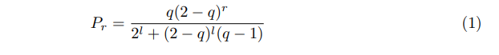

# PATema2
Repository folosit pentru a prezenta prima tema2 la Proiectarea Algoritmilor

!Acest cod nu este functional-doar o schita!

# Descriere
Vom simula turneele de meciuri ale unor echipe, ale caror nume si punctaje vor fi citite din fisierul Input, folosind exemplul grafului jucătorilor de
tenis care au fost clasati numărul 1 în ATP. 
## EXERCITIUL 1
Creati graful turneului!Vârfurile grafului vor fi cele 32 de echipe care au intrat în turneu.

-initializez graful(functie din curs);

-citesc datele necesare din fisierul de Input;

-simulez meciul intre 2 echipe pentru a afla afla castigatorul(in functie de nr de puncte) si indecsii pe care acestia se afla in fisier;

     !Se va creea un vector (numit drum) care va fi initializat cu 1, pentru indexul castigatorilor si 0 in rest-astfel vom sti exact cu ce pozitii sa lucram mai departe!

### Functia "turneu"

-imi va initializa vectorii de drum si de victorii cu 0;

-simuleaza meciurile pentru fiecare 2 echipe, actualizand vectorul drum cu echipele castigatoare;

-mai departe vom lucra doar cu echipele castigatoare(au valoarea asociata in vectorul "drum" egalka cu 1), incrementand numarul de victorii pentru fiecare;

-reactualizam numarul de echipe cu care lucram(doar cele castigatoare);

-scriu matricea de adiacenta obtinuta in fisierul de output;

## EXERCITIUL 2

-pentru fiecare echipa in parte calculez prestigiul cu formula (1), retinandu-l intr-un vector de tip float;

(q=0.15,r=nr. victorii ale unei echipe,l=nr de meciuri necesare pt castigarea campionatului=5);

-afisez echipele si prestigiul descrescator, dupa prestigiu ;

## MAIN

-deschid fisierele de ccitire/afisare;

-apelez functiile necesare implementarii cerintelor;

-eliberez memoria folosita;
# Dificultati;

-implementarea structurilor necesare meciurilor;

-implementareea formulei matematice;

-gandirea cu "vectori" care retin date precum nr. de victorii si prestigiul;
